# World Clock Overlay & Work Tracker

A Python desktop overlay, built with Tkinter, that shows your local time and up to four more timezones. It floats above other windows and records your work sessions in a local SQLite database.

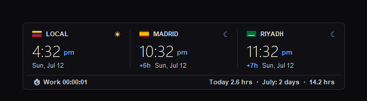

## Features

- **Up to 5 clocks in one panel**: your local time plus four timezones you pick, drawn as one rounded panel with thin divider lines.
- **Day/night icons**: each clock shows a sun (7am–7pm) or a moon.
- **Time difference**: each remote clock shows its offset from your local time, e.g. `+6h`.
- **Two layouts**: horizontal columns or a vertical stack; double-click the overlay to switch.
- **Setup wizard**: on first launch, pick the timezones to display.
- **Work tracker**: each run of the overlay is recorded as a work session (start, end, duration) in `~/.world_clock_work_tracker.db`.
- **Status bar**: a live stopwatch for the current session, plus today's hours and the days worked and total hours in the current month. Sessions are clipped at midnight, so one day can never show more than 24 hours.
- **Pause tracking**: click the ⏱ timer, or hover the overlay and hold Space for half a second — the divider line fills from both edges to the center, and when the halves meet the timer pauses. Paused time is never written to the database; the same gesture resumes.
- **Themed context menu**: the right-click menu is drawn with the active theme (panel colors, border, hover accent) instead of the native white system menu, and restyles instantly when you switch themes.
- **Hide to tray**: tap H over the overlay to hide it instantly (instant on purpose: holding a key leaks key-repeat into the window you're typing in); the tray icon stays. A single click on the tray icon peeks — the overlay shows until the mouse leaves it, then fades out over half a second (moving back onto it cancels the fade) — and a double click brings it back for good.
- **Tray tooltip**: hovering the tray icon shows the session timer plus today's and the month's hours — no click needed, works while the overlay is hidden.
- **Six themes**: Frosted Dark, Frosted Light, Cyberpunk Neon, Nordic Frost, Raycast Dark (flat near-black, hairline borders), and Liquid Glass — a live-rendered glass panel: the app samples what's behind the window and re-renders it with blur, saturation, edge refraction, and a specular rim, so text stays readable over anything. On Liquid Glass the scroll wheel adjusts the glass tint instead of window opacity. Two side notes: the backdrop refreshes ~10×/s on a background thread (faster while dragging, paused while hidden), and while this theme is active the overlay is invisible in screenshots and screen shares (it excludes itself from capture to sample its backdrop).
- **Translucency**: set the overlay between 30% and 100% opacity from the right-click menu, or scroll the mouse wheel while hovering the overlay.
- **Readable on light backgrounds**: secondary text (labels, dates, status bar) is near-white — near-black in the light theme — and every text is drawn with a 1px contrast shadow, so the translucent overlay stays legible over white windows.
- **Click-through (Windows)**: clicks on the empty background pass through to the window underneath.
- **Corner anchoring**: when the layout toggles, the window keeps its nearest screen corner instead of drifting.
- **Drag feedback**: the overlay dims to 30% opacity while being dragged.
- **Saved state**: position and preferences are written to `~/.world_clock_overlay.json` on exit and restored on launch.
- **System tray icon** (optional): mirrors the right-click menu; requires the Pillow and pystray packages.

## Screenshots

### Vertical layout (with seconds)

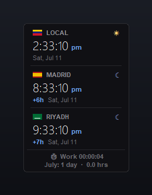

### Themes

| Frosted Light | Cyberpunk Neon | Nordic Frost |
| --- | --- | --- |
| 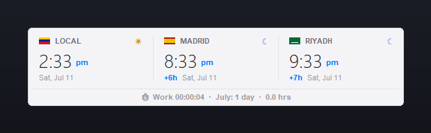 | 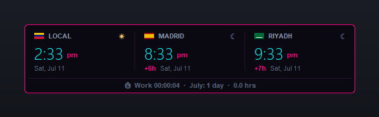 | 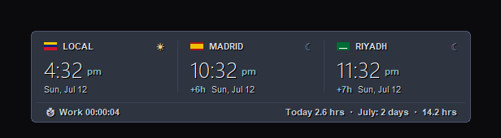 |

Over a busy background (Raycast is near-opaque flat; Liquid Glass blurs what's behind it):

| Raycast Dark | Liquid Glass |
| --- | --- |
| 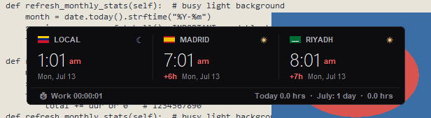 | 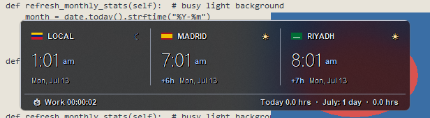 |

### Setup wizard

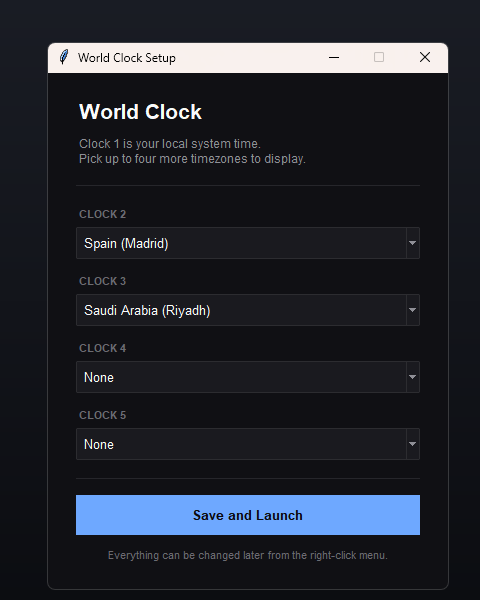

## Demos

### Pause with the space bar

Hover the overlay and hold Space: the divider fills from both edges with easing; when the halves meet (0.5 s), tracking pauses. Hold again to resume.


### Pause with a click

Click the ⏱ timer text in the status strip to pause and resume.

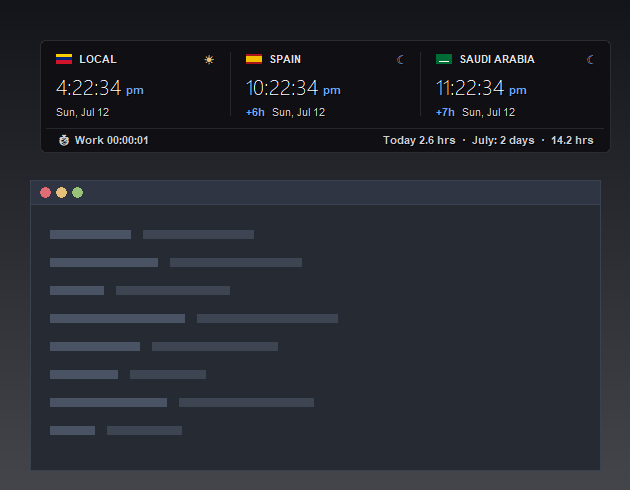

### Scroll-wheel translucency

Scroll the mouse wheel while hovering the overlay to step the opacity between 30% and 100%.

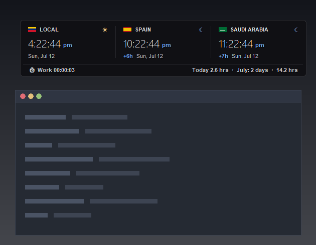

### Themed context menu

The right-click menu uses the active theme and restyles the moment you pick a new one.

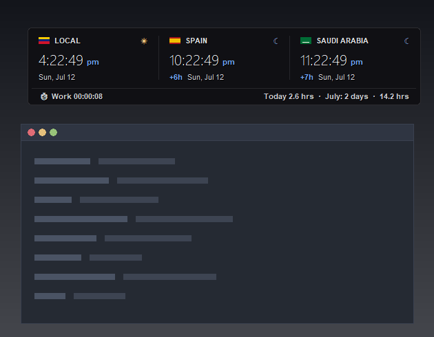

### Layout toggle

Double-click the overlay to switch between horizontal and vertical layouts; the window keeps its nearest screen corner.

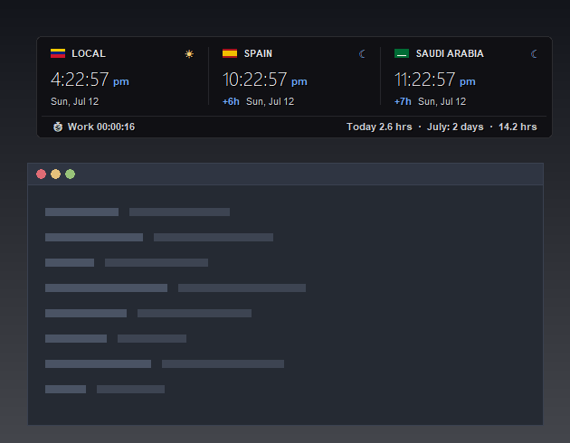

## Running the Application

### Windows host

Double-click `run_clock.bat` from the WSL network path:
```text
\\wsl.localhost\<distro-name>\home\<username>\world-clock-overlay\
```
The script installs Pillow and pystray if they are missing, then launches `pythonw.exe` in the background.

### WSL

1. Install Tkinter:
   ```bash
   sudo apt-get update && sudo apt-get install python3-tk
   ```
2. Launch:
   ```bash
   python3 clock.py
   ```

## Controls

- **Move**: click and drag anywhere on the overlay.
- **Pause/resume the work timer**: click the ⏱ timer text, or hold Space for 0.5 s while hovering the overlay.
- **Hide to tray**: tap H while hovering the overlay, or right-click → "Hide Overlay". Single-click the tray icon to peek (fades away when the mouse leaves the overlay); double-click it to bring the overlay back permanently.
- **Toggle layout**: double-click to switch between horizontal and vertical.
- **Translucency**: scroll the mouse wheel while hovering the overlay (steps through 30/50/70/85/100%).
- **Options**: right-click the overlay (or the tray icon) for time format, seconds, translucency, themes, and "Reset Clocks Setup Wizard".

## Tests

The layout tests check that labels and icons do not overlap:
```bash
python3 test_layout.py
```

The behavior tests check scroll-wheel translucency stepping, work-hour accounting (including midnight clipping), pause/resume by click and by held Space, the hold progress bar, and the themed context menu (uses an isolated profile, never touches your real config or database):
```bash
python3 test_wheel_stats.py
```
